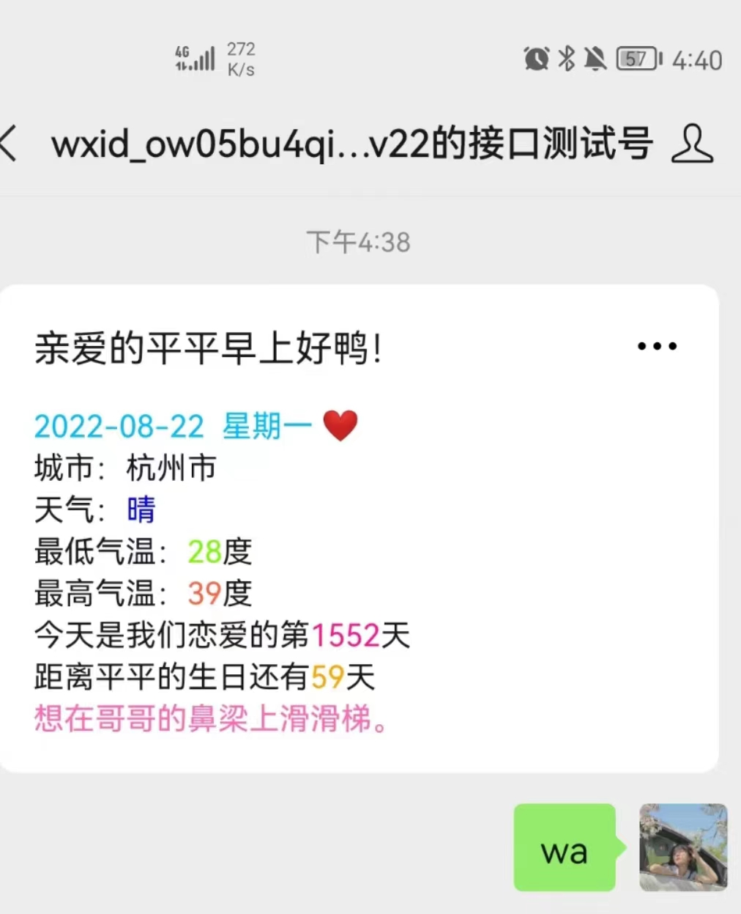
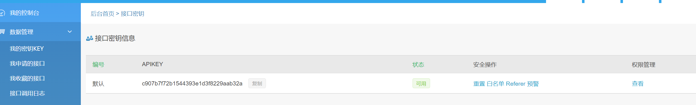

(JAVA)微信公众号推送早安问候以及天气预报



教程

1.注册微信测试账号，编辑模板
https://mp.weixin.qq.com/debug/cgi-bin/sandbox?t=sandbox/login


扫码关注得到用户的id


编辑模板


示例:

```txt
{{riqi.DATA}} {{beizhu.DATA}} 
城市：杭州市
天气：{{tianqi.DATA}} 
最低气温：{{low.DATA}}度 
最高气温：{{high.DATA}}度 
今天是我们恋爱的第{{lianai.DATA}}天 
距离平平的生日还有{{shengri.DATA}}天 
{{caihongpi.DATA}} 
{{jinju.DATA}}
```

2.spring boot 开发，对接第三方
	- IDEA新建springboot项目，导入src文件夹（注意包的名称要和自己的对应起来）
	- 在修改新生成的pom.xml，将需要的依赖复制过去

3.百度地图开放平台
https://lbsyun.baidu.com/apiconsole/center#/home

认证成为开发人员（很快）

创建应用并提交（获得应用的AK）


4.彩虹屁平台
https://www.tianapi.com/

首页彩虹屁语录接口免费申请


复制接口密钥



启动IDEA本地项目即可，后续可以上传到云端