# (JAVA版一键安装在没有jre配置的电脑上，支持修改配置文件变为自己的专属微信推送)微信公众号推送早安问候和天气预报

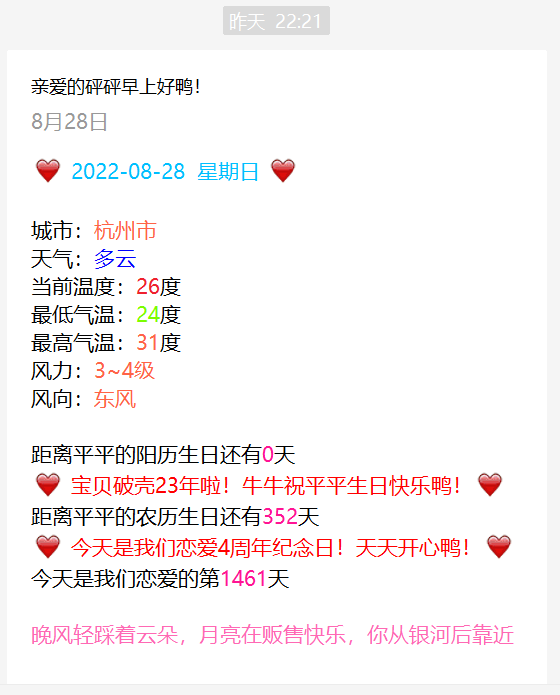

## 一、获得自己的一些配置信息

### 1.注册微信测试账号

https://mp.weixin.qq.com/debug/cgi-bin/sandbox?t=sandbox/login

#### 1.1 获得==appId==   和   ==secret==

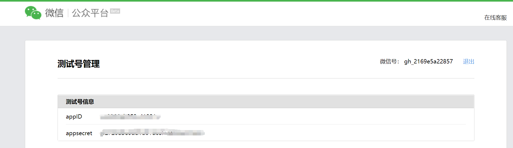

#### 1.2 扫码关注得到用户的微信号==userId==，

配置文件会用到关注测试公众号的==userId==，当userId为多个的时候，按照配置文件的格式依次复制粘贴
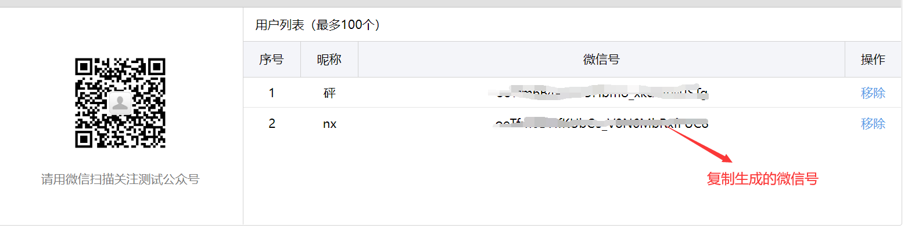

#### 1.3 新增并且编辑==templateId==模板

将下面这个数据模板，复制到微信测试平台的新建模板的内容

```txt
{{love.DATA}} {{riqi.DATA}} {{love.DATA}}

城市：{{city.DATA}}
天气：{{tianqi.DATA}} 
当前温度：{{temp.DATA}}度
最低气温：{{low.DATA}}度 
最高气温：{{high.DATA}}度 
风力：{{wc_day.DATA}}
风向：{{wd_day.DATA}}
{{solarBirthLogo.DATA}} 
{{love.DATA}} 距离宝贝的阳历生日还有 {{solarBirth.DATA}} 天 {{love.DATA}} 
{{lunarBirthLogo.DATA}} 
{{love.DATA}} 距离宝贝的农历生日还有 {{lunarBirth.DATA}} 天 {{love.DATA}} 
{{lianaiLogo.DATA}} 
{{love.DATA}} 今天是我们恋爱的第 {{lianai.DATA}} 天 {{love.DATA}} 

{{caihongpi.DATA}} 
```

模板标题自己随便取鸭！

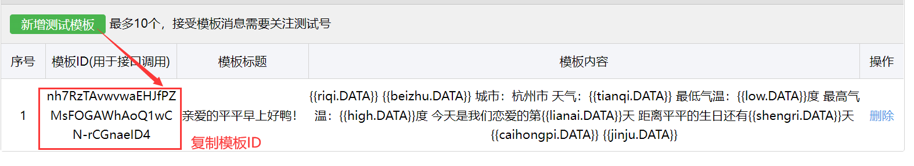

得到模板ID，配置文件会用到==templateId==

### 2.获取接受推送的区域编码==district_id==

获得配置文件中的==district_id==，例如：杭州的区域编码：district_id = 330100，最好是市级别的区域编码，区级别或者更细分的级别，百度地图可能读取不到结果，如果程序出错就关闭黑框并且检查配置文件内容，重新双击exe文件或者桌面快捷方式

### 3.百度地图开放平台==ak==

https://lbsyun.baidu.com/apiconsole/center#/home认证成为开发人员（很快）

创建应用并提交，获得配置文件的==ak==

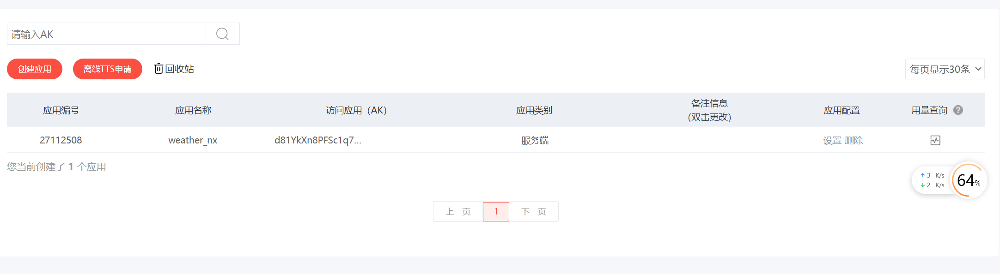

### 4.彩虹屁平台

https://www.tianapi.com/ 认证1分钟

#### 4.1 免费申请彩虹屁语录接口

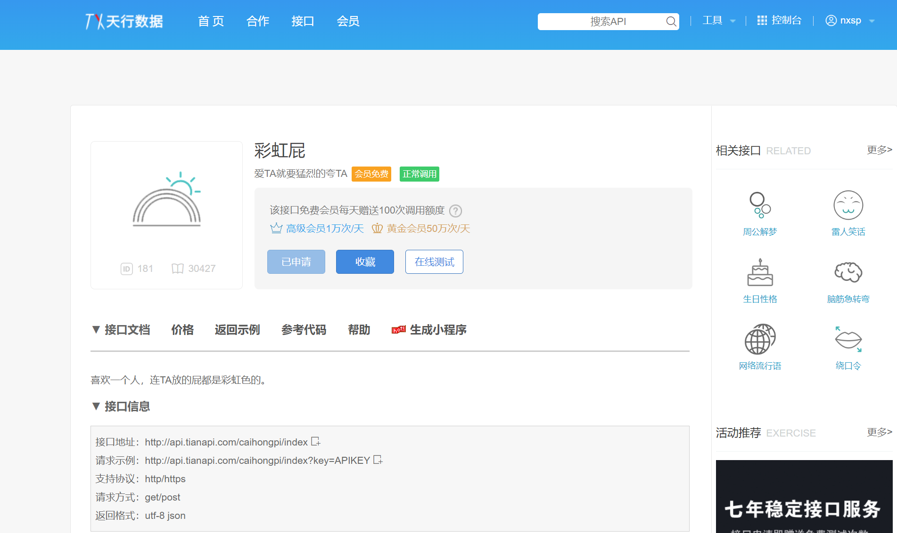

#### 4.2 复制接口密钥==rainbowKey==

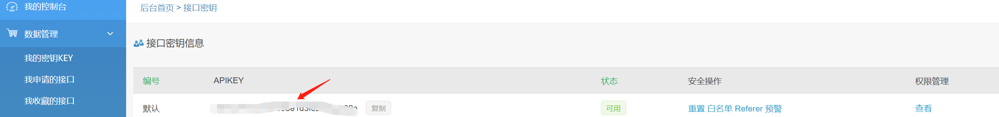

上面所有的步骤都是为了获得我们执行程序的配置信息

### 5. 当然还有被推送人的==loveDate==和==birthday==

## 二、安装NxSpWechatPushSetup.exe文件和配置文件

### 1.安装步骤

#### 1.1.双击NxSpWechatPushSetup.exe文件

可以选择安装在本电脑的路径，记住这个安装路径

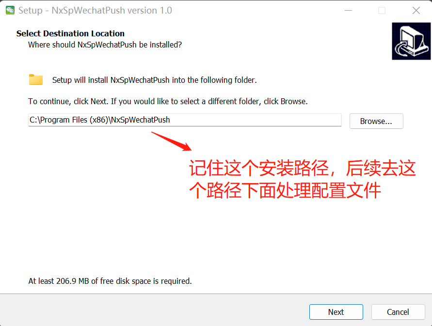

#### 1.2 创建桌面快捷方式

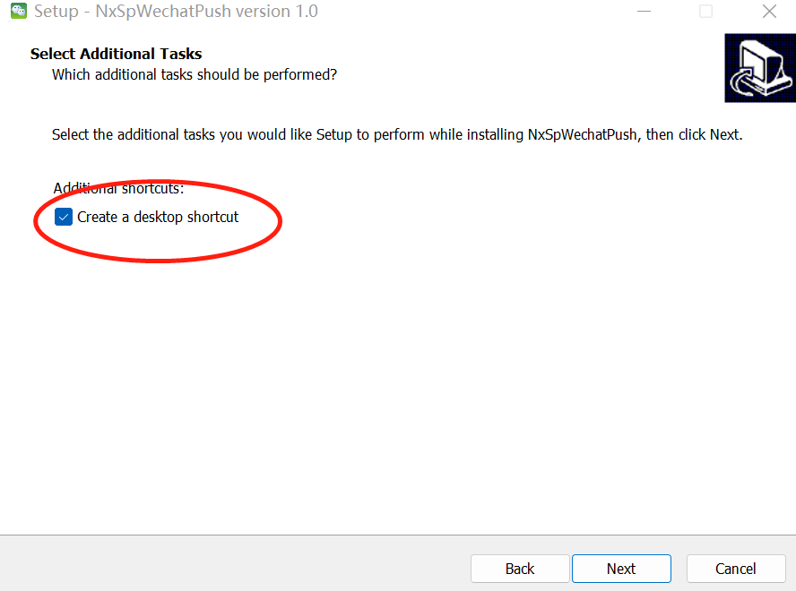

安装完成后，先不启动exe程序，如下图，把勾去掉

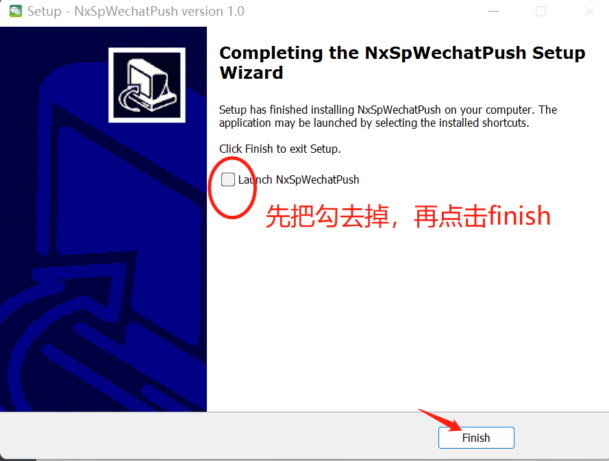

### 2.配置application-conf.yml文件（**最重要**）

打开安装路径，在config目录有一个application-conf.yml文件，你只需要把这个文件里面的内容填成自己的就好，耐心一点，就快成功了

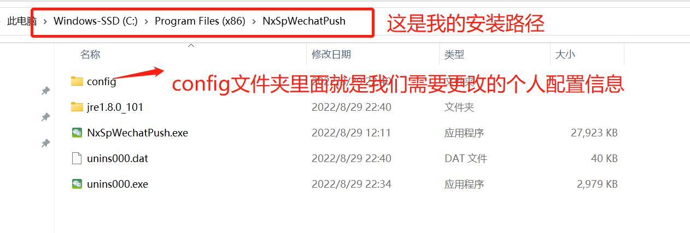

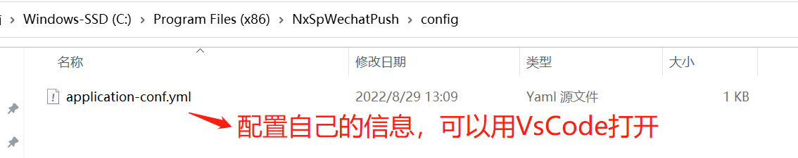

#### 2.1 填入配置信息

按照配置文件提示，填写个人的配置文件，不要修改文件名，修改完就可以保存了

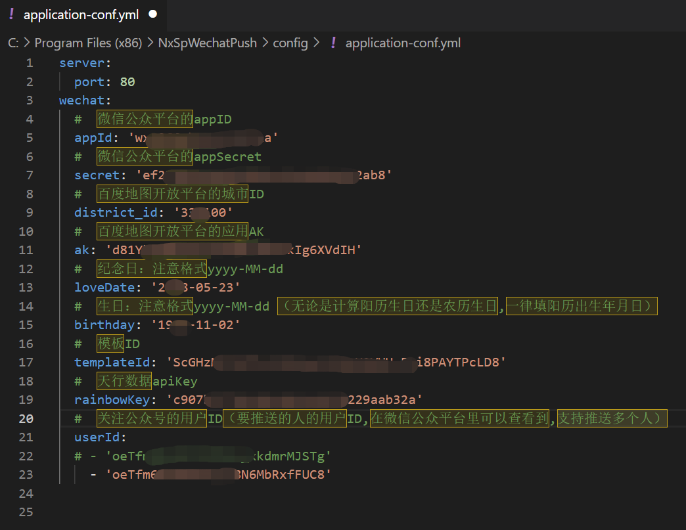

#### 2.2.返回安装目录

双击启动NxSpWechatPush.exe，或者双击桌面的快捷方式，启动过程中跳出啥框都点击确定

#### 2.3 浏览器测试是否成功

```txt
localhost/test
```

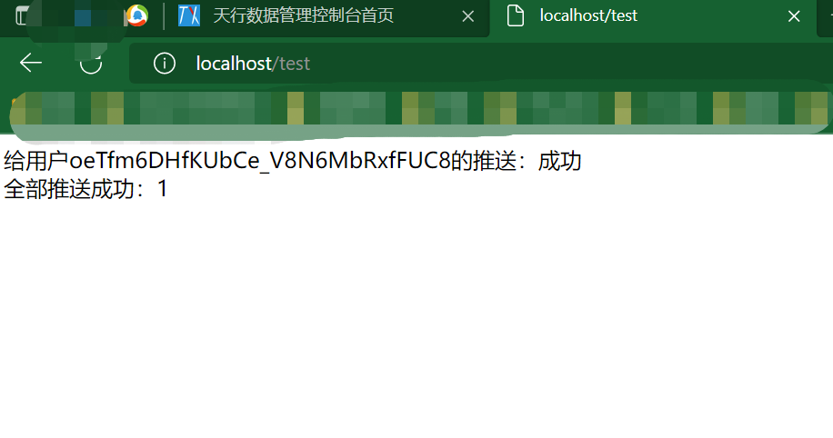

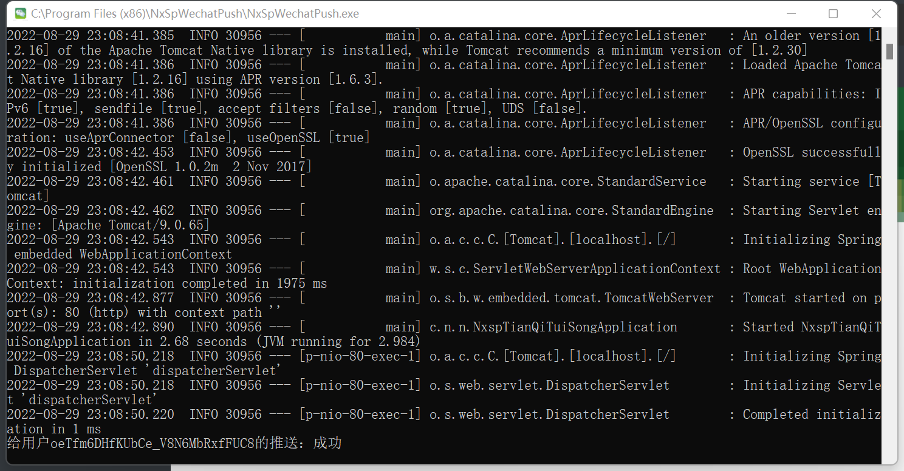

也可以看到微信测试号给你推送消息了

如果测试不成功，请反复检查那个配置文件是否配置正确

#### 2.3 每天早上7：30自动推送消息

程序后台已经写好了定时发送的功能，只需要保持NXSpWechatPush.exe程序一直运行就好

## 三、给个Star鸭！

本代码是二次开发，集合了好几个人的智慧结晶，谢谢你们！

